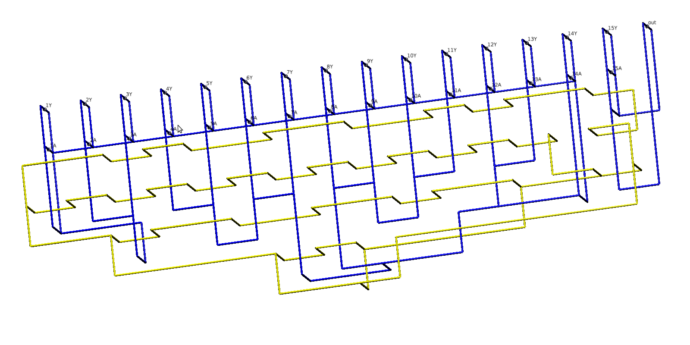
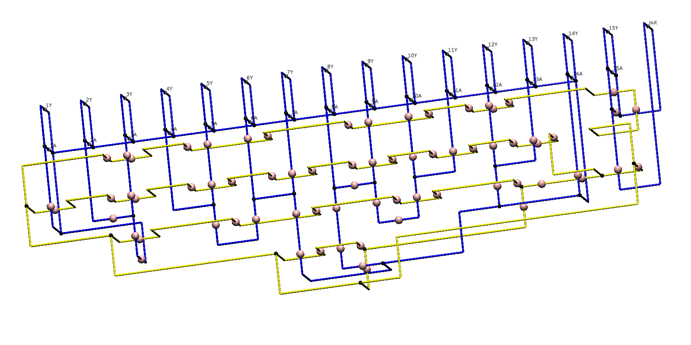
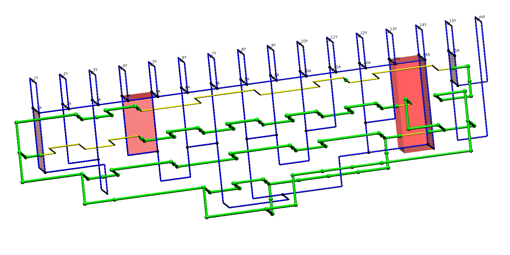

# CORRiere delle alpha

Extracting correlation surfaces from quantum circuits protected by the surface code

This is an Eclipse Java project. All libraries are in lib.

main file is Vis.java in src/corr 

The tool takes a geometry, visualises, and process it for the following steps:

It computes where braiding happens (e.g. pink spheres)

It determines if a certain correlation surface can be constructed (i.e. searches through all possible constructions)

